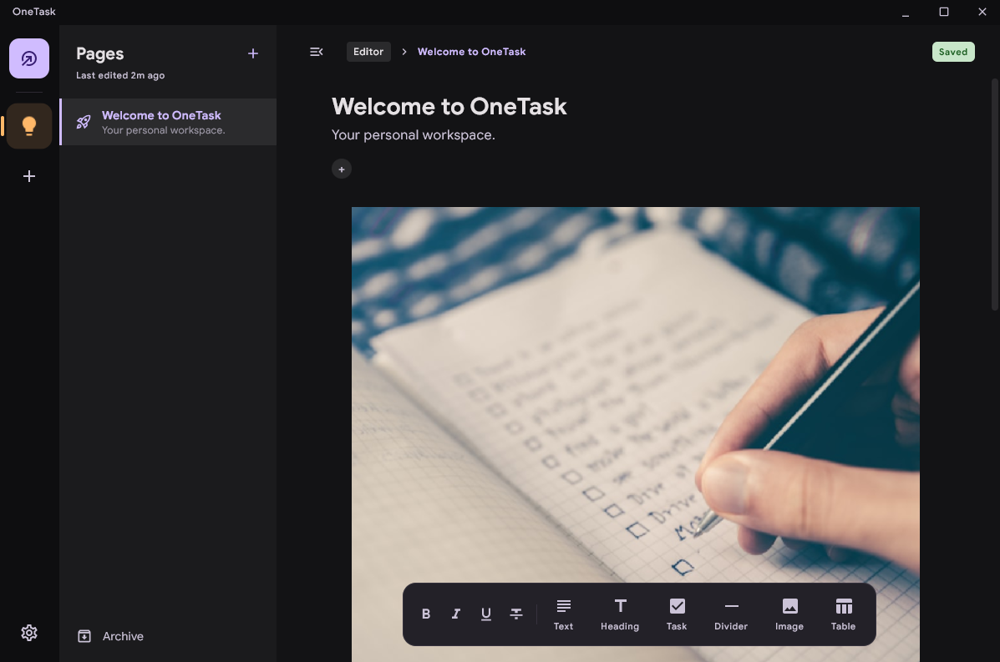

# OneTask

[](LICENSE)
[](https://github.com/iammohdzaki/OneTask-Desktop/releases)
[](https://github.com/iammohdzaki/OneTask-Desktop/actions/workflows/release.yml)


OneTask is a flexible, block-based workspace application built with **Compose Multiplatform**. It allows you to organize your thoughts, tasks, and data in a unified environment that feels local-first and high-performance.



## Features

- **Block-Based Editor**: Use Text, Heading, Checkbox, Table, and Image blocks to build your pages.
- **Rich Text Support**: WYSIWYG formatting with Bold, Italic, and Underline.
- **Local-First Database**: Powered by SQLDelight for fast, offline-first data persistence.
- **Optimized Image Loading**: High-performance image rendering and caching via Landscapist (Coil 3).
- **MVI Architecture**: Robust state management for a predictable user experience.
- **Privacy First**: Local storage by default with optional notebook privacy settings.

---

## Installation

### Windows (Important)
1. Download the latest `.msi` or `.exe` from the [Releases](https://github.com/iammohdzaki/OneTask-Desktop/releases) page.
2. When you run the installer, you may see a blue **"Windows protected your PC"** (SmartScreen) warning. 
   - This happens because the installer is not digitally signed by a paid Certificate Authority.
3. To proceed, click **"More info"** and then click the **"Run anyway"** button.
4. Follow the remaining setup prompts to finish installation.

### macOS
1. Download the latest `.dmg` from the Releases page.
2. Open the `.dmg` and drag **OneTask** into your **Applications** folder.

### Linux
1. Download the latest `.deb` package.
2. Install via your package manager: `sudo dpkg -i onetask_xxx.deb`.

---

## Building Locally

### Prerequisites
- JDK 17 or higher.
- IntelliJ IDEA (recommended) or Android Studio.

### Commands
To run the desktop application:
```bash
./gradlew :desktopApp:run
```

To build a production installer for your current OS:
```bash
./gradlew :desktopApp:package
```

## Contributing

We welcome contributions! Please see our [CONTRIBUTING.md](CONTRIBUTING.md) for guidelines on how to get started.

## License

This project is licensed under the MIT License - see the [LICENSE](LICENSE) file for details.
